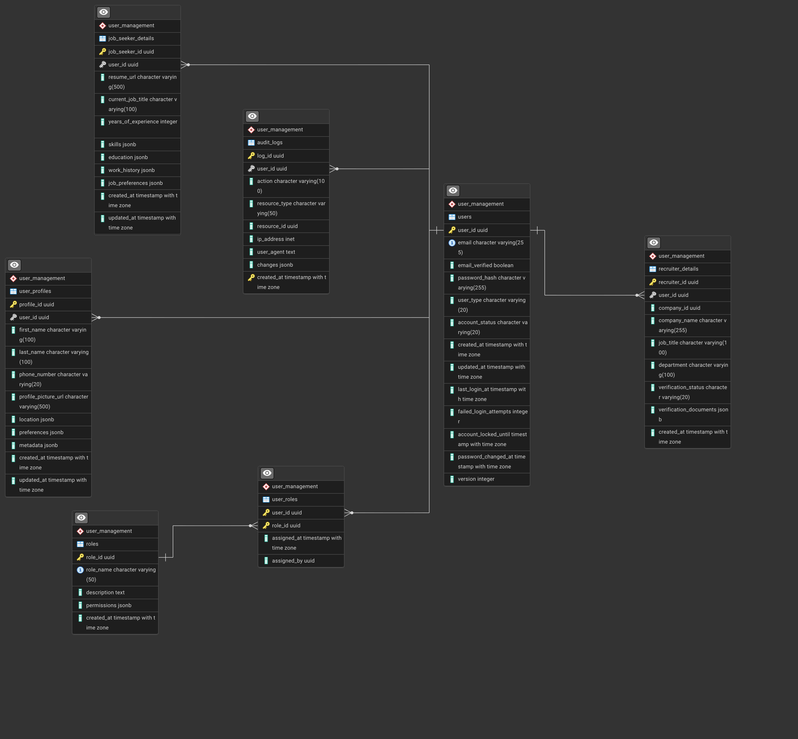

# User Management Service — Schema and Indexing

This README summarizes the schema and indexing strategy for the SecureHire User Management Service, optimized for integrity, scalability, and query performance across millions of users. 

## Overview

The schema is decomposed by responsibility into core identity, profile, type-specific details, RBAC, and append-only audit logs, balancing strict normalization with JSONB flexibility for evolving attributes.   
Indexing uses B-tree for equality/range queries, GIN for JSONB containment, partial indexes for hot slices, and time partitioning for large append-only audit data. 

## Entity summary

- users: Core identity, authentication state, lifecycle flags, and concurrency control.   
- user_profiles: One-to-one profile attributes and flexible JSONB for location, preferences, and metadata.   
- recruiter_details: Recruiter-only attributes and verification metadata separated to avoid NULL-heavy rows for job seekers.   
- job_seeker_details: Job seeker-only attributes including resume link and JSONB for skills, education, work history, and preferences.   
- roles: RBAC role catalog with JSONB permissions for evolvable capabilities.   
- user_roles: Junction for many-to-many user↔role assignments with audit fields.   
- audit_logs: Append-only trail with actor, action, resource, and JSONB changes partitioned monthly for scale. 

## Table details

### users
- Keys: `user_id UUID PK` for global uniqueness and non-enumerability across distributed systems.   
- Auth: `email UNIQUE`, `password_hash`, `email_verified`, plus `account_status` with CHECK constraints for lifecycle states.   
- Security: `failed_login_attempts`, `account_locked_until`, and `password_changed_at` for brute-force control and token revocation.   
- Concurrency: `version INT` for optimistic locking to prevent lost updates at high write concurrency. 

### user_profiles
- Relationship: 1:1 with users via `user_id`, storing names, phone, picture URL, and flexible JSONB for `location`, `preferences`, and `metadata`.   
- Rationale: Keeps auth rows narrow and separates optional or evolving profile data for gradual enrichment. 

### recruiter_details
- Relationship: 1:1 with users via `user_id`, including `company_id`, `company_name`, `job_title`, `department`, `verification_status`, and `verification_documents JSONB`.   
- Rationale: Clean separation of recruiter-only attributes and verification workflow data from job seeker records. 

### job_seeker_details
- Relationship: 1:1 with users via `user_id`, including `resume_url`, `current_job_title`, `years_of_experience`, plus JSONB `skills`, `education`, `work_history`, and `job_preferences`.   
- Rationale: Captures heterogeneous and nested career data without frequent schema migrations while enabling targeted queries. 

### roles
- Catalog: `role_name UNIQUE`, `description`, and `permissions JSONB` for fine-grained capabilities and evolvable access models.   
- Rationale: Centralizes permission semantics and enables system-wide changes without schema alteration. 

### user_roles
- Junction: Composite PK `(user_id, role_id)` with `assigned_at` and `assigned_by` for traceability.   
- Rationale: Supports many-to-many role assignment and efficient access checks. 

### audit_logs
- Fields: `user_id`, `action`, `resource_type`, `resource_id`, `ip_address`, `user_agent`, `changes JSONB`, `created_at`.   
- Partitioning: Native RANGE partitioning by month to bound index sizes, enable pruning, and streamline archival. 

## Indexing strategy

- B-tree: Default for equality and range predicates on structured columns such as `email`, `created_at`, `account_status`, and `user_type`.   
- GIN on JSONB: For containment and key-existence queries on `location`, `skills`, and `permissions`, with awareness of higher write maintenance cost.   
- Partial indexes: Apply to hot predicates like `account_status = 'ACTIVE'` or `verification_status = 'PENDING'` to reduce index size and improve selectivity.   
- Partition-local indexes: Create per-partition B-tree indexes on `audit_logs` to leverage partition pruning on time-bounded workloads. 

## Suggested indexes per table

### users
- Unique B-tree on `email` for login and duplicate prevention.   
- Composite B-tree on `(account_status, user_type)` for admin listing filters.   
- Partial B-tree on common slice, for example `WHERE account_status = 'ACTIVE'`. 

### user_profiles
- B-tree on `user_id` for 1:1 fetches.   
- GIN on `location` JSONB for geographic containment queries. 

### recruiter_details
- B-tree on `user_id` and `company_id` for joins and rosters by company.   
- Partial B-tree on `verification_status = 'PENDING'` for review queues. 

### job_seeker_details
- B-tree on `user_id` and optionally `years_of_experience` for range filters.   
- GIN on `skills` JSONB for skill containment search. 

### roles and user_roles
- B-tree unique on `role_name`, and composite PK on `(user_id, role_id)`.   
- Optional GIN on `permissions` JSONB if server-side permission existence queries are frequent. 

### audit_logs
- Monthly partitions with local B-tree on `created_at` and `action`.   
- Prune scans by filtering time ranges in queries to exploit partition elimination. 

## JSONB usage guidelines

- Prefer JSONB over JSON for queryable dynamic attributes due to binary storage, operators, and index support.   
- Add GIN indexes only where latency-sensitive queries use `@>`, `?`, or `?&` operators, balancing read gains against higher update costs. 

## Maintenance checklist

- Use `EXPLAIN ANALYZE` to confirm planner benefits before adding nonessential indexes to avoid write amplification.   
- Periodically re-evaluate partial-index predicates and JSONB index coverage as query patterns evolve.   
- Tune autovacuum and monitor write amplification on GIN-heavy tables, especially under bursty updates. 

## ER summary (textual)

- users 1:1 user_profiles, users 1:1 recruiter_details or job_seeker_details by user_type, users M:N roles via user_roles, and users 1:M audit_logs.   
- recruiter_details optionally references company context by `company_id` as a service-level relation in the broader architecture. 
